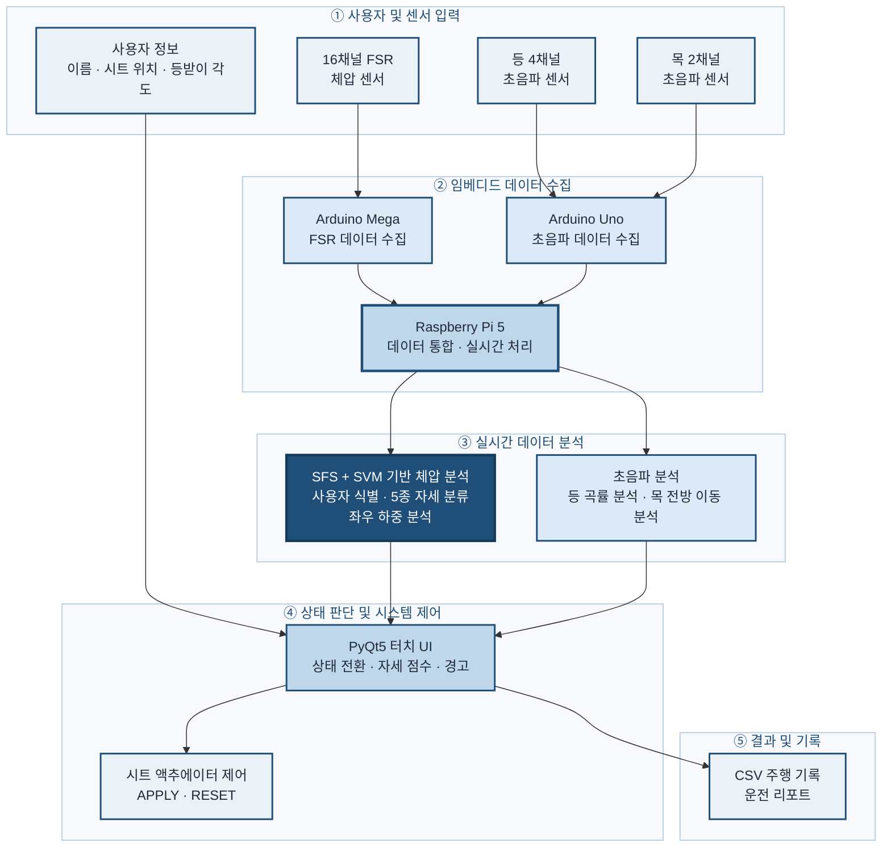

# Seat-ID — A Smarter Seat That Understands You.


### 체압·초음파 기반 운전자 맞춤형 스마트 시트

**2026 임베디드소프트웨어 경진대회 자유공모 부문 출품작**  
**Team GAMJA**

**FSR Pressure Sensing · SFS Sensor Optimization · SVM · COP Analysis · Ultrasonic Posture Estimation · Raspberry Pi 5 · Arduino · Linear Actuator**


Seat-ID는 16채널 체압센서와 등·목 초음파센서를 이용해 착석 사용자를 식별하고, 사용자별 시트 설정 적용과 실시간 자세 분석·경고·운전 리포트를 제공하는 Raspberry Pi 기반 스마트 차량 시트 시스템입니다.

카메라를 사용하지 않고 체압과 거리 데이터를 활용하며, 사용자 식별부터 좌석 개인화, 자세 모니터링, 액추에이터 제어까지 하나의 시스템에서 수행합니다.

---

## 1. 주요 기능

| 기능 | 설명 |
|---|---|
| 체압 기반 사용자 식별 | 16채널 FSR 체압 특징과 사용자 식별 SVM을 이용해 등록 사용자를 자동으로 식별합니다. |
| 사용자별 시트 자동 적용 | 식별된 사용자의 시트 위치와 등받이 각도를 불러와 액추에이터에 적용합니다. |
| 5종 착석 자세 분류 | 정상·좌측 쏠림·우측 쏠림·전방 기울임·후방 기울임 상태를 실시간으로 분류합니다. |
| 체압 분포 분석 | 16채널 보정 체압값을 이용해 압력 히트맵과 좌우 하중 균형을 계산합니다. |
| 등 자세 분석 | 4채널 초음파센서로 등 곡선을 근사하고 구부러짐 정도를 분석합니다. |
| 목 자세 분석 | HEAD–C7 초음파센서로 목의 전방 이동과 자세 변화를 분석합니다. |
| 실시간 자세 경고 | 자세 이상이 설정된 시간 이상 유지될 때 경고를 표시합니다. |
| 운전 리포트 | 주행 중 자세 점수·상태·경고를 기록하고 세션 종료 후 리포트를 제공합니다. |
| 물리 버튼 연동 | 주행 시작(S)·주차(P)·주행 종료(E) 버튼으로 시스템 상태를 제어합니다. |

## 2. 시스템 구성


### 시스템 동작 흐름

1. Arduino가 체압·등·목 센서값을 수집하여 Raspberry Pi로 전달합니다.
2. Raspberry Pi에서 체압값의 기준압력을 제거하고 센서 데이터를 보정합니다.
3. 사용자 식별 SVM과 자세 분류 SVM을 이용해 사용자와 착석 상태를 예측합니다.
4. 등·목 초음파 데이터로 등 곡률과 목 전방 이동 상태를 분석합니다.
5. PyQt5 UI에 체압 히트맵, 자세 점수, 경고 상태를 실시간으로 표시합니다.
6. 식별된 사용자의 시트 설정을 액추에이터에 적용합니다.
7. 주행 종료 시 자세 점수와 경고 이력을 CSV 및 운전 리포트로 저장합니다.

---

## 3. 버튼 입력과 상태 전환

| 버튼 | 입력 조건 | 상태 전환 | 동작 |
|---|---|---|---|
| 주행 시작(S) | IDLE / PARK_SAFE | USER_SELECT → DRIVE | 화면을 켜고 센서 측정과 사용자 자동 식별을 시작합니다. |
| 주차(P) | DRIVE | PARK_SAFE | 자세 분석과 운전 세션을 일시정지하고 시트를 기준 위치로 복귀합니다. |
| 주행 종료(E) | DRIVE / PARK_SAFE | REPORT | 세션을 종료하고 CSV 주행 기록과 운전 리포트를 생성합니다. |

---

## 4. 하드웨어 구성

| 구분 | 구성 |
|---|---|
| 메인 제어부 | Raspberry Pi 5 |
| 체압 측정부 | 16채널 FSR 압력센서, Arduino Mega |
| 등 자세 측정부 | 4채널 초음파센서, Arduino Uno |
| 목 자세 측정부 | HEAD–C7 기준 2채널 초음파센서 |
| 시트 제어부 | 시트 전후·등받이 각도 조절용 리니어 액추에이터 |
| 사용자 입력부 | 주행 시작·주차·주행 종료 물리 버튼 |
| 디스플레이 | Raspberry Pi 연결 터치 디스플레이 |

---

## 5. 소프트웨어 구성

| 구분 | 사용 기술 |
|---|---|
| 운영 환경 | Raspberry Pi OS |
| 개발 언어 | Python, Arduino C/C++ |
| 사용자 인터페이스 | PyQt5 |
| 데이터 처리 | NumPy, pandas |
| 머신러닝 | scikit-learn RBF-SVM |
| 모델 저장 | joblib / PKL |
| 센서 통신 | USB Serial, pySerial |
| 데이터 저장 | CSV, JSON, NPY |
| 실행 관리 | Bash Shell Script |

---

## 6. 주요 파일 구성

현재 실행 파일은 Raspberry Pi 운용 환경에서의 상대경로 호환성을 위해 저장소 최상위 경로에 배치되어 있습니다.

### UI 및 통합 제어

| 파일 | 역할 |
|---|---|
| `app.py` | PyQt5 터치 UI, 사용자 등록·식별, 화면 상태 전환, 자세 경고 및 운전 리포트를 관리합니다. |
| `hardware_bridge.py` | UI에서 발생한 사용자 선택·주차·종료 이벤트를 액추에이터 제어부로 전달합니다. |
| `smart_chair_actuator_module.py` | 사용자 시트 설정을 액추에이터 구동시간으로 변환하고 APPLY·RESET을 수행합니다. |
| `detect_serial_roles.py` | 연결된 Arduino 장치의 역할과 시리얼 포트를 확인합니다. |

### 체압 분석 및 SVM

| 파일 | 역할 |
|---|---|
| `real_time_prediction_rasp.py` | 16채널 체압 보정, 사용자 식별 SVM, 자세 분류 SVM 및 좌우 하중 분석을 수행합니다. |
| `pressure_database.py` | 신규 사용자의 대표 체압값을 수집하여 사용자 식별 DB를 생성합니다. |
| `train_user_model.py` | 등록 사용자 식별 SVM과 입력 스케일러를 학습·저장합니다. |
| `collect_posture_data.py` | 5종 자세 분류 SVM에 사용할 체압 데이터를 수집합니다. |

### 자세 데이터 정제

| 파일 | 역할 |
|---|---|
| `merge_posture_data.py` | 자세별 또는 사용자별로 수집된 학습 데이터를 통합합니다. |
| `review_dataset.py` | 자세 학습 데이터의 분포와 이상 데이터를 검토합니다. |
| `remove_flagged.py` | 검토 과정에서 표시된 이상 데이터를 제거합니다. |
| `similarity_dedup.py` | 지나치게 유사하거나 중복된 학습 데이터를 정리합니다. |

### 초음파 자세 분석

| 파일 | 역할 |
|---|---|
| `spine_curve_monitor_4ch_no_s4.py` | 등 4채널 초음파센서로 등 곡률과 구부러짐 상태를 분석합니다. |
| `neck_cva_monitor_2ch.py` | 목 2채널 초음파센서로 전방 이동과 자세 변화 상태를 분석합니다. |

### Arduino 펌웨어

| 파일 | 역할 |
|---|---|
| `arduino_mega.ino` | 16채널 FSR 압력센서 데이터를 측정·전송합니다. |
| `arduino_back.ino` | 등 자세 측정용 초음파센서를 제어합니다. |
| `arduino_neck_2ch.ino` | 목 자세 측정용 2채널 초음파센서를 제어합니다. |
| `smart_chair_arduino_3.ino` | 시트와 등받이 액추에이터를 제어합니다. |
| `butten_code.ino` | 주행 시작·주차·주행 종료 물리 버튼 입력을 처리합니다. |

### 실행 스크립트

| 파일 | 역할 |
|---|---|
| `run_all.sh` | 등·목 센서 분석, 액추에이터 제어 및 PyQt5 UI를 통합 실행합니다. |
| `run_app.sh` | PyQt5 메인 UI를 실행합니다. |
| `run_actuator.sh` | 액추에이터 제어 브리지를 실행합니다. |
| `run_back_ultrasonic.sh` | 등 초음파 자세 분석 프로그램을 실행합니다. |
| `run_neck_monitor.sh` | 목 초음파 자세 분석 프로그램을 실행합니다. |

### 학습 모델 및 기준 데이터

| 파일 | 역할 |
|---|---|
| `user_model.pkl` | 등록 사용자 식별 SVM 모델 |
| `user_scaler.pkl` | 사용자 식별 입력값 표준화 스케일러 |
| `svm_model.pkl` | 5종 착석 자세 분류 SVM 모델 |
| `scaler.pkl` | 자세 분류 입력값 표준화 스케일러 |
| `selected_baseline.npy` | 체압센서별 기준압력 |
| `selected_sensor_positions.csv` | 자세 분류에 사용하는 16개 센서 위치 정보 |

---

## 7. 데이터 및 모델 처리 흐름

### 사용자 식별 SVM

```text
16채널 체압 데이터 수집
→ pressure_database.csv
→ train_user_model.py
→ user_model.pkl + user_scaler.pkl
→ 실시간 사용자 ID 및 신뢰도 예측
```

### 자세 분류 SVM

```text
정상·좌우 쏠림·전후 기울임 체압 데이터 수집
→ posture_database.csv
→ 자세 데이터 정제 및 RBF-SVM 학습
→ svm_model.pkl + scaler.pkl
→ 실시간 자세 상태 및 신뢰도 예측
```

`posture_database.csv`는 자세 SVM 학습 단계에서 사용하는 원본 데이터이며, Raspberry Pi의 실시간 운용 단계에서는 학습이 완료된 `svm_model.pkl`과 `scaler.pkl`을 불러옵니다.

### 초음파 자세 분석

```text
등 초음파센서
→ 곡선 근사 및 구부러짐 분석
→ posture_feedback.json
→ PyQt5 UI

목 초음파센서
→ 전방 이동 및 각도 변화 분석
→ neck_posture_feedback.json
→ PyQt5 UI
```

`posture_feedback.json`과 `neck_posture_feedback.json`은 SVM 학습 DB가 아니라, 초음파 자세 분석 프로그램과 UI 사이에서 최신 상태를 전달하는 실시간 공유 파일입니다.

---

## 8. 실행 방법

### 8.1 저장소 내려받기

```bash
git clone https://github.com/jipark0215/2026ESWContest_free_GAMJA.git
cd 2026ESWContest_free_GAMJA
```

### 8.2 Python 패키지 설치

```bash
python3 -m pip install PyQt5 numpy pandas scikit-learn joblib pyserial
```

### 8.3 Arduino 연결

각 Arduino에 다음 펌웨어를 업로드한 후 Raspberry Pi에 연결합니다.

- 체압센서: `arduino_mega.ino`
- 등 초음파센서: `arduino_back.ino`
- 목 초음파센서: `arduino_neck_2ch.ino`
- 액추에이터: `smart_chair_arduino_3.ino`
- 물리 버튼: `butten_code.ino`

연결된 장치의 포트는 다음 명령으로 확인할 수 있습니다.

```bash
python3 detect_serial_roles.py
```

### 8.4 시리얼 포트 설정

저장소 최상위 경로에 `seat_id_ports.env` 파일을 생성하고 실제 연결된 포트를 입력합니다.

```bash
export SEAT_ID_PRESSURE_PORT=/dev/serial/by-id/압력센서_장치경로
export SEAT_ID_ULTRASONIC_PORT=/dev/serial/by-id/등초음파_장치경로
export SEAT_ID_NECK_PORT=/dev/serial/by-id/목초음파_장치경로
export SEAT_ID_ACTUATOR_PORT=/dev/serial/by-id/액추에이터_장치경로
```

### 8.5 실행 권한 설정

```bash
chmod +x run_all.sh
chmod +x run_app.sh
chmod +x run_actuator.sh
chmod +x run_back_ultrasonic.sh
chmod +x run_neck_monitor.sh
```

### 8.6 전체 시스템 실행

```bash
./run_all.sh
```

`run_all.sh`는 시리얼 포트를 확인한 뒤 등·목 자세 분석, 액추에이터 제어, PyQt5 UI를 순서대로 실행합니다.

---

## 9. 실행 중 생성되는 데이터

다음 파일은 프로그램 실행 및 사용자 등록 과정에서 자동으로 생성·갱신됩니다.

| 파일 | 저장 내용 |
|---|---|
| `user_profile.csv` | 사용자 정보, 시트 위치 및 등받이 각도 |
| `pressure_database.csv` | 사용자별 16채널 대표 체압값 |
| `pressure_user_registration.csv` | 신규 사용자 등록 요청 및 체압 데이터 경로 |
| `actuator_profile.csv` | 사용자별 시트·등받이 액추에이터 구동시간 |
| `hardware_command.csv` | 시간, 이벤트, 사용자 ID, 사용자 이름 |
| `posture_feedback.json` | 등 자세 분석 결과와 경고 상태 |
| `neck_posture_feedback.json` | 목 각도·전방 이동·경고 상태 |
| `logs/session_*.csv` | 주행 세션별 자세 점수·상태·경고 기록 |

개인정보와 실제 사용자 측정 데이터는 공개 저장소에 포함하지 않습니다.

---

## 10. 구현상의 특징

- 사용자 식별과 자세 분류에 각각 독립된 SVM·스케일러를 적용했습니다.
- 동일한 16채널 체압 입력으로 사용자 ID와 착석 자세를 동시에 분석합니다.
- 체압센서와 초음파센서를 함께 사용해 좌면·등·목 상태를 구분하여 측정합니다.
- UI와 하드웨어 제어부를 분리하고 CSV 이벤트를 통해 제어 명령을 전달합니다.
- 액추에이터 APPLY·RESET 및 주차 전환 시 기준 위치 복귀 기능을 구현했습니다.
- 사용자별 시트 설정과 자세 기준을 저장하여 동일한 좌석을 개인화된 환경으로 사용할 수 있습니다.
- 운전 세션별 자세 점수와 경고를 누적하여 리포트로 제공합니다.

## 11. 역할 분담

| Member | Role | Main Responsibilities |
|---|---|---|
| **유나현** | Team Leader / Hardware / Ultrasonic Sensor | - 리니어 액추에이터 기반 시트 전후·등받이 각도 조절 모형 3D 모델링 및 3D 프린팅 부품 설계<br>- Arduino Uno 기반 다채널 초음파 센서 측정 HW 구성 및 거리 데이터 수집 구조 구현<br>- 센서 기준값 측정, 중앙값·EMA 필터링, 오류 처리 및 자세 경고 로직 구현<br>- 초음파 기반 목·등 자세 측정 시스템 통합 테스트 및 오류 디버깅<br>- 후두부-C7 거리 기반 목 전방 자세 및 2차 곡선 적합 기반 등 곡률 판정 알고리즘 구현 |
| **구여은** | Hardware / Actuator | - 리니어 액추에이터 기반 시트 전후·등받이 각도 구동부 3D 설계<br>- 랙·피니언 기어를 활용한 등받이 각도 조절 메커니즘 구현<br>- Arduino 및 모터드라이버 기반 리니어 액추에이터 제어 회로 구현<br>- 액추에이터 스트로크·속도 기반 위치 및 각도-구동시간 변환 로직 설계 |
| **박정인** | Embedded / AI / FSR Sensor | - SW 개발 일정 수립 및 업무 진행상황 관리<br>- FSR 압력센서 데이터 전처리 및 SFS 기반 최적 센서 위치 선정 알고리즘 구현<br>- SVM 기반 사용자 식별 및 5종 착석 자세 분류 모델 개발·검증<br>- Raspberry Pi 기반 실시간 압력 데이터 수집·전처리·추론 코드 구현 및 센서 통신 연동<br>- FSR 압력센서 배열을 고려한 시트 구조 설계 및 하중 전달·분산 구조 구현<br>- 실시간 사용자·자세 판정 로직 통합 및 임베디드 환경 동작 검증 |
| **성호원** | UI / System Integration | - Raspberry Pi 5·PyQt5 기반 터치 UI 및 한글·숫자 가상 키보드 구현<br>- 사용자 식별·등록, 시트 설정·주행 대시보드·자세 경고·운전 리포트 화면 구성<br>- S·P·F 롤리 버튼과 주행·주차·종료 UI 상태 전환 연동<br>- 체압 사용자 식별 결과와 연동한 사용자 데이터 수집 및 SVM 재학습 과정 자동화<br>- 16채널 압력 히트맵과 등록 분석 기반 자세 점수·그래프·경고 로직 구현<br>- 사용자·시트·HW 명령·주행 로그 CSV 연동 및 액추에이터 APPLY·RESET 통합 테스트·디버깅 |
| **장예은** | AI / FSR Sensor / Data | - CNN 기반 사용자·자세 분류 모델 구축 및 성능 비교·검증<br>- FSR 센서 민감도에 따른 저항값 선정 및 센서 회로 설계·배선 구현<br>- Arduino Mega 기반 다채널 FSR 압력센서 데이터 통신 구조 구현<br>- 압력센서 데이터 수집·통합·유사 데이터 제거·이상치 검토 과정 자동화<br>- 초기 가상데이터 구축 및 재학습용 데이터셋 구축<br>- 구축 데이터셋 기반 5종 착석 자세 분류 모델 학습 및 재학습·테스트를 통한 성능 검증 |

---
